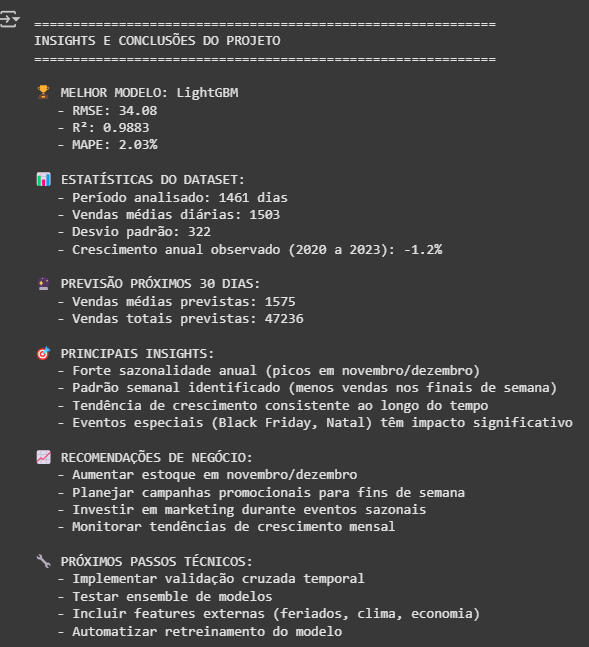
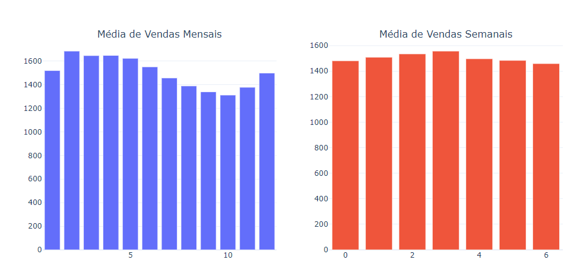
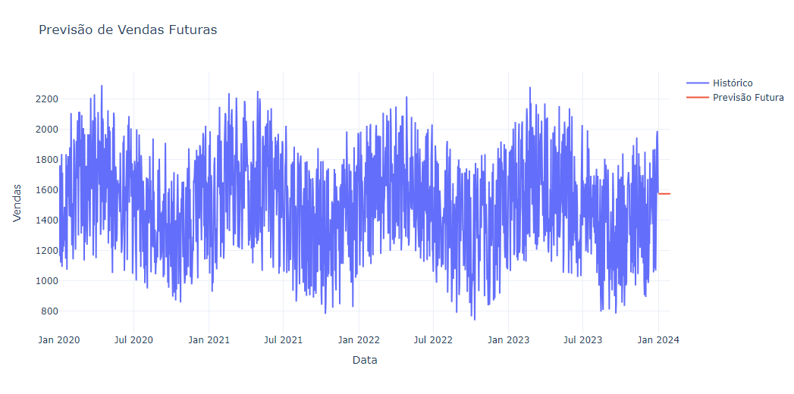

# 📈 Projeto de Previsão de Vendas – Séries Temporais

Este projeto tem como objetivo aplicar diferentes técnicas de **previsão de séries temporais** sobre um conjunto de dados **simulados** de vendas.  
O foco é testar, comparar e avaliar o desempenho de modelos estatísticos e de machine learning em um cenário semelhante ao de varejo.

---

## 📝 Objetivo do Projeto
- Explorar dados de vendas simulados.
- Realizar análises exploratórias e visuais para identificar padrões, tendências e sazonalidade.
- Construir modelos de previsão utilizando diferentes abordagens.
- Comparar os resultados e selecionar o modelo com melhor desempenho.
- Gerar previsões futuras de vendas.

---

## 🗂️ Estrutura do Repositório
- `projeto_time_series.ipynb` → Notebook com todo o código de análise e modelagem.
- `images/` → Pasta contendo os gráficos utilizados no README.

---

## 🛠️ Metodologia
1. **Coleta e Preparação dos Dados:**  
   Utilização de dados **simulados** de vendas mensais/semanais. Limpeza e organização para análise.

2. **Análise Exploratória:**  
   Identificação de tendências, padrões e sazonalidades.  
   Visualizações gráficas para entender o comportamento da série temporal.

3. **Modelagem:**  
   Aplicação de modelos clássicos e de machine learning, tais como:
   - ARIMA
   - Prophet
   - LightGBM para previsão de séries temporais.

4. **Validação:**  
   Avaliação dos modelos através de métricas de erro (MAPE, RMSE, MAE) para comparação de performance.

5. **Previsão Futura:**  
   Uso do modelo com melhor performance para prever vendas futuras.

---

## 📊 Resultados Visuais  

Para melhor entendimento do comportamento das vendas e da performance dos modelos, foram gerados os seguintes gráficos:  

### 1. **Insights e Conclusões do Projeto**

### 2. **Média de Vendas Mensais e Semanais**  

### 3. **Comparação das Previsões dos Modelos vs. Real**  

### 4. **Previsão de Vendas Futuras (LightGBM)**  

---

## 📝 Observação Importante
Os dados utilizados neste projeto são **simulados** e criados exclusivamente para fins educacionais e demonstração das metodologias de previsão de séries temporais.  
Não correspondem a dados reais de nenhuma empresa.

---

## 🧑‍💻 Autor
Pietro – Cientista de Dados e Graduado em Estatística.

